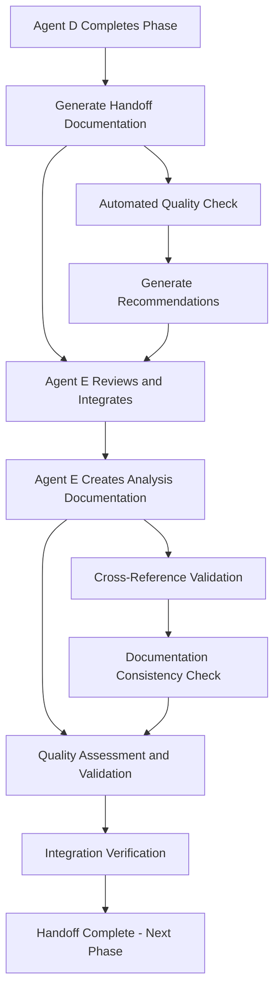

# 🤝 Agent Handoff Documentation Framework
## Comprehensive Multi-Agent Coordination & Knowledge Transfer System

**Framework Version:** 1.0.0  
**Created:** August 22, 2025  
**Purpose:** Standardize handoff processes between Agent D and Agent E for seamless collaboration  
**Status:** ACTIVE - Supporting extensive Agent E documentation efforts

---

## 📋 EXECUTIVE SUMMARY

This framework establishes comprehensive handoff protocols to support Agent E's extensive documentation work for Agent D. It provides standardized templates, validation checklists, and integration tracking to ensure seamless knowledge transfer and collaboration between agents.

### 🎯 Framework Objectives
1. **Standardize Handoff Processes**: Create consistent documentation and transfer protocols
2. **Support Agent E's Documentation Work**: Provide tools and frameworks for extensive documentation efforts
3. **Ensure Knowledge Preservation**: Maintain complete audit trails and knowledge transfer validation
4. **Enable Seamless Integration**: Facilitate smooth collaboration between Agent D and Agent E
5. **Automate Quality Assurance**: Implement automated validation and quality checking

---

## 🏗️ HANDOFF FRAMEWORK ARCHITECTURE

### Core Components
```
📁 Agent Handoff Framework
├── 📄 Handoff Templates
│   ├── Mission Handoff Template
│   ├── Technical Handoff Template  
│   ├── Documentation Handoff Template
│   └── Integration Handoff Template
├── ✅ Validation Checklists
│   ├── Completeness Validation
│   ├── Quality Assurance Checklist
│   ├── Integration Verification
│   └── Success Criteria Validation
├── 📊 Tracking Systems
│   ├── Handoff Progress Tracking
│   ├── Documentation Quality Metrics
│   ├── Integration Status Dashboard
│   └── Collaboration Analytics
└── 🔧 Automation Tools
    ├── Documentation Generator
    ├── Quality Assessment Engine
    ├── Integration Validator
    └── Handoff Orchestrator
```

---

## 📝 HANDOFF TEMPLATES

### 1. Mission Handoff Template

```markdown
# MISSION HANDOFF DOCUMENTATION
## From: [Source Agent] → To: [Target Agent]

### HANDOFF METADATA
- **Handoff ID**: [Unique Identifier]
- **Date**: [YYYY-MM-DD HH:MM]
- **From Agent**: [Agent Role and Specialization]
- **To Agent**: [Agent Role and Specialization]
- **Handoff Type**: [Mission/Technical/Documentation/Integration]
- **Priority Level**: [Critical/High/Medium/Low]

### SOURCE AGENT STATUS
- **Current Phase**: [Phase Description]
- **Hours Completed**: [X/Total Hours]
- **Mission Completion**: [Percentage]%
- **Active Systems**: [List of operational systems]
- **Key Achievements**: [Major accomplishments]
- **Performance Metrics**: [Quantified results]

### HANDOFF CONTENT
#### Completed Deliverables
- [ ] [Deliverable 1]: [Status and Location]
- [ ] [Deliverable 2]: [Status and Location]
- [ ] [Deliverable 3]: [Status and Location]

#### Active Projects
- [ ] [Project 1]: [Current Status and Next Steps]
- [ ] [Project 2]: [Current Status and Next Steps]

#### Knowledge Transfer Items
- [ ] [Technical Documentation]: [Location and Access Instructions]
- [ ] [Implementation Details]: [Key Technical Insights]
- [ ] [Lessons Learned]: [Critical Knowledge and Best Practices]

#### Dependencies and Integrations
- [ ] [Dependency 1]: [Status and Requirements]
- [ ] [Integration Point 1]: [Configuration and Validation]

### TARGET AGENT REQUIREMENTS
- **Expected Actions**: [What the target agent should do]
- **Integration Points**: [How to integrate with handed-off work]
- **Validation Requirements**: [How to validate successful handoff]
- **Success Criteria**: [Measurable success indicators]

### HANDOFF VALIDATION
- [ ] All deliverables verified and accessible
- [ ] Documentation complete and up-to-date
- [ ] Integration points validated
- [ ] Target agent acknowledges receipt
- [ ] Success criteria established
- [ ] Follow-up schedule defined

### NOTES AND COMMENTS
[Additional context, concerns, or recommendations]
```

### 2. Technical Handoff Template

```markdown
# TECHNICAL HANDOFF DOCUMENTATION
## System: [System/Component Name]

### TECHNICAL OVERVIEW
- **System Architecture**: [High-level architecture description]
- **Core Technologies**: [Technologies and frameworks used]
- **Key Components**: [Major system components]
- **Performance Metrics**: [Current performance baselines]

### IMPLEMENTATION DETAILS
#### Code Repositories
- [ ] **Main Repository**: [URL and access instructions]
- [ ] **Configuration Repository**: [URL and access instructions]  
- [ ] **Documentation Repository**: [URL and access instructions]

#### Key Files and Locations
- [ ] **Core Implementation**: [File paths and descriptions]
- [ ] **Configuration Files**: [Locations and purposes]
- [ ] **Test Suites**: [Test locations and execution instructions]
- [ ] **Documentation**: [Documentation locations and formats]

#### Database and Data
- [ ] **Database Schema**: [Schema documentation and location]
- [ ] **Data Migration Scripts**: [Migration instructions and scripts]
- [ ] **Backup Procedures**: [Backup and restore instructions]

### OPERATIONAL PROCEDURES
#### Deployment Process
1. [Step 1]: [Detailed instructions]
2. [Step 2]: [Detailed instructions]  
3. [Step 3]: [Detailed instructions]

#### Monitoring and Maintenance
- [ ] **Monitoring Setup**: [Monitoring configuration and access]
- [ ] **Alert Configuration**: [Alert setup and escalation]
- [ ] **Maintenance Procedures**: [Regular maintenance tasks]

#### Troubleshooting Guide
- [ ] **Common Issues**: [Known issues and solutions]
- [ ] **Debug Procedures**: [Debugging steps and tools]
- [ ] **Escalation Contacts**: [Support contacts and procedures]

### INTEGRATION REQUIREMENTS
- [ ] **API Dependencies**: [External API requirements and configuration]
- [ ] **System Dependencies**: [Required system components]
- [ ] **Network Configuration**: [Network requirements and setup]
- [ ] **Security Requirements**: [Security configuration and compliance]

### VALIDATION CHECKLIST
- [ ] System builds and deploys successfully
- [ ] All tests pass with expected results
- [ ] Monitoring and alerting functional
- [ ] Documentation complete and accurate
- [ ] Target agent can operate system independently
```

### 3. Documentation Handoff Template

```markdown
# DOCUMENTATION HANDOFF TEMPLATE
## Supporting Agent E's Extensive Documentation Efforts

### DOCUMENTATION INVENTORY
#### Completed Documentation
- [ ] **[Document 1]**: [Location, Status, Quality Score]
- [ ] **[Document 2]**: [Location, Status, Quality Score]
- [ ] **[Document 3]**: [Location, Status, Quality Score]

#### In-Progress Documentation  
- [ ] **[Document A]**: [Current Status, Completion %, Next Steps]
- [ ] **[Document B]**: [Current Status, Completion %, Next Steps]

#### Planned Documentation
- [ ] **[Future Document 1]**: [Priority, Timeline, Requirements]
- [ ] **[Future Document 2]**: [Priority, Timeline, Requirements]

### DOCUMENTATION QUALITY METRICS
- **Total Documents**: [Number]
- **Average Quality Score**: [Score/100]
- **Word Count Total**: [Total Words]
- **Coverage Percentage**: [Coverage %]
- **Update Frequency**: [Daily/Weekly/As-needed]

### DOCUMENTATION STANDARDS
#### Format Requirements
- [ ] **Markdown Format**: Standard .md files with consistent formatting
- [ ] **Header Structure**: Consistent H1, H2, H3 hierarchy
- [ ] **Metadata**: Title, date, author, version, status
- [ ] **Cross-References**: Internal links and navigation
- [ ] **Code Blocks**: Proper syntax highlighting and formatting

#### Content Requirements
- [ ] **Executive Summary**: High-level overview for all major documents
- [ ] **Technical Details**: Comprehensive implementation details
- [ ] **Examples**: Code examples and usage demonstrations
- [ ] **Metrics**: Quantified results and performance data
- [ ] **Validation**: Testing and validation procedures

### AGENT E SUPPORT FRAMEWORK
#### Documentation Assistance Tools
- [ ] **Quality Assessment**: Automated quality scoring and feedback
- [ ] **Cross-Reference Validation**: Link checking and reference validation  
- [ ] **Format Standardization**: Automated formatting consistency
- [ ] **Metadata Management**: Automated metadata generation and updates

#### Collaboration Support
- [ ] **Version Control**: Documentation versioning and change tracking
- [ ] **Review Process**: Peer review and validation workflows
- [ ] **Integration Tracking**: Documentation integration with main project
- [ ] **Progress Monitoring**: Real-time documentation progress tracking

### HANDOFF VALIDATION FOR DOCUMENTATION
- [ ] All documentation accessible and properly formatted
- [ ] Quality scores meet minimum standards (80/100)
- [ ] Cross-references validated and functional
- [ ] Agent E has full access and editing capabilities
- [ ] Documentation integration points established
- [ ] Progress tracking and monitoring active
```

---

## ✅ VALIDATION CHECKLISTS

### Completeness Validation Checklist

```markdown
## HANDOFF COMPLETENESS VALIDATION

### DOCUMENTATION COMPLETENESS
- [ ] All required documents present and accessible
- [ ] Documentation covers all key areas and components
- [ ] Technical specifications complete and detailed
- [ ] User guides and operational procedures included
- [ ] API documentation and integration guides present

### SYSTEM COMPLETENESS  
- [ ] All system components operational and accessible
- [ ] Configuration files complete and validated
- [ ] Database schemas and migrations documented
- [ ] Test suites comprehensive and passing
- [ ] Monitoring and alerting systems functional

### KNOWLEDGE TRANSFER COMPLETENESS
- [ ] Key technical decisions documented with rationale
- [ ] Lessons learned captured and shared
- [ ] Best practices and recommendations included
- [ ] Known issues and workarounds documented
- [ ] Future roadmap and recommendations provided

### INTEGRATION COMPLETENESS
- [ ] All integration points identified and documented
- [ ] API endpoints tested and validated
- [ ] Data flow diagrams complete and accurate
- [ ] Dependency relationships mapped and verified
- [ ] Security requirements and implementations documented
```

### Quality Assurance Checklist

```markdown
## HANDOFF QUALITY ASSURANCE

### DOCUMENTATION QUALITY
- [ ] **Accuracy**: Technical information verified and current
- [ ] **Clarity**: Language clear and understandable
- [ ] **Completeness**: All necessary information included
- [ ] **Consistency**: Formatting and style consistent throughout
- [ ] **Accessibility**: Documents easily findable and navigable

### TECHNICAL QUALITY
- [ ] **Functionality**: All systems and components working as designed
- [ ] **Performance**: Performance meets established benchmarks
- [ ] **Security**: Security requirements met and validated
- [ ] **Reliability**: Systems stable and fault-tolerant
- [ ] **Maintainability**: Code and systems easy to maintain and extend

### PROCESS QUALITY
- [ ] **Standardization**: Processes follow established standards
- [ ] **Automation**: Appropriate automation in place
- [ ] **Monitoring**: Monitoring and alerting comprehensive
- [ ] **Testing**: Comprehensive testing coverage and validation
- [ ] **Documentation**: Process documentation complete and current
```

---

## 📊 TRACKING SYSTEMS

### Handoff Progress Tracking

```python
class HandoffProgressTracker:
    """Track progress of handoff activities between agents"""
    
    def __init__(self):
        self.handoffs = {}
        self.progress_metrics = {}
        
    def create_handoff(self, handoff_id, from_agent, to_agent, handoff_type):
        """Create new handoff tracking entry"""
        self.handoffs[handoff_id] = {
            'from_agent': from_agent,
            'to_agent': to_agent,
            'type': handoff_type,
            'status': 'initiated',
            'created_at': datetime.now(),
            'deliverables': [],
            'validation_items': [],
            'completion_percentage': 0
        }
        
    def update_progress(self, handoff_id, deliverable, status):
        """Update progress for specific deliverable"""
        if handoff_id in self.handoffs:
            self.handoffs[handoff_id]['deliverables'].append({
                'item': deliverable,
                'status': status,
                'updated_at': datetime.now()
            })
            self._calculate_completion(handoff_id)
            
    def get_progress_dashboard(self, agent_id):
        """Get progress dashboard for specific agent"""
        agent_handoffs = {
            hid: handoff for hid, handoff in self.handoffs.items()
            if handoff['from_agent'] == agent_id or handoff['to_agent'] == agent_id
        }
        
        return {
            'total_handoffs': len(agent_handoffs),
            'active_handoffs': len([h for h in agent_handoffs.values() if h['status'] == 'in_progress']),
            'completed_handoffs': len([h for h in agent_handoffs.values() if h['status'] == 'completed']),
            'average_completion': sum(h['completion_percentage'] for h in agent_handoffs.values()) / len(agent_handoffs) if agent_handoffs else 0
        }
```

### Documentation Quality Metrics

```python
class DocumentationQualityTracker:
    """Track quality metrics for Agent E's extensive documentation work"""
    
    def __init__(self):
        self.documents = {}
        self.quality_standards = {
            'min_word_count': 500,
            'min_sections': 3,
            'required_elements': ['summary', 'details', 'examples'],
            'quality_threshold': 80
        }
        
    def assess_document_quality(self, doc_path, agent_author):
        """Assess quality of a document created by an agent"""
        content = self._read_document(doc_path)
        
        metrics = {
            'word_count': len(content.split()),
            'section_count': content.count('#'),
            'has_summary': 'summary' in content.lower(),
            'has_examples': 'example' in content.lower(),
            'has_metrics': any(metric in content.lower() for metric in ['metric', 'performance', 'result']),
            'format_score': self._assess_format_quality(content),
            'content_score': self._assess_content_quality(content)
        }
        
        overall_score = self._calculate_overall_score(metrics)
        
        self.documents[doc_path] = {
            'agent_author': agent_author,
            'metrics': metrics,
            'quality_score': overall_score,
            'assessment_date': datetime.now(),
            'recommendations': self._generate_recommendations(metrics)
        }
        
        return overall_score, metrics
        
    def get_agent_documentation_summary(self, agent_id):
        """Get documentation summary for specific agent (particularly Agent E)"""
        agent_docs = {
            path: doc for path, doc in self.documents.items()
            if doc['agent_author'] == agent_id
        }
        
        if not agent_docs:
            return {'message': 'No documents found for agent'}
            
        return {
            'total_documents': len(agent_docs),
            'average_quality': sum(doc['quality_score'] for doc in agent_docs.values()) / len(agent_docs),
            'total_word_count': sum(doc['metrics']['word_count'] for doc in agent_docs.values()),
            'high_quality_docs': len([doc for doc in agent_docs.values() if doc['quality_score'] >= 90]),
            'docs_needing_improvement': len([doc for doc in agent_docs.values() if doc['quality_score'] < 80]),
            'documentation_coverage': self._calculate_coverage(agent_docs)
        }
```

---

## 🔧 AUTOMATION TOOLS

### Documentation Generator

```python
class HandoffDocumentationGenerator:
    """Generate standardized handoff documentation automatically"""
    
    def __init__(self):
        self.templates = {
            'mission_handoff': self._load_template('mission_handoff.md'),
            'technical_handoff': self._load_template('technical_handoff.md'), 
            'documentation_handoff': self._load_template('documentation_handoff.md')
        }
        
    def generate_handoff_document(self, handoff_type, from_agent, to_agent, context_data):
        """Generate complete handoff document based on type and context"""
        template = self.templates.get(handoff_type, self.templates['mission_handoff'])
        
        # Populate template with context data
        document = template.format(
            from_agent=from_agent,
            to_agent=to_agent,
            handoff_id=self._generate_handoff_id(),
            timestamp=datetime.now().isoformat(),
            **context_data
        )
        
        # Add automated analysis and recommendations
        document += self._add_automated_analysis(context_data)
        
        return document
        
    def generate_agent_e_support_documentation(self, agent_d_status, agent_e_requirements):
        """Generate specific documentation to support Agent E's work with Agent D"""
        support_doc = f"""
# Agent E Documentation Support Framework
## Supporting Extensive Documentation Efforts for Agent D Integration

### Agent D Current Status Summary
{self._format_agent_status(agent_d_status)}

### Documentation Support Tools Available
{self._format_support_tools()}

### Quality Assurance Framework
{self._format_quality_framework()}

### Integration Tracking System
{self._format_integration_tracking()}

### Recommended Documentation Workflow
{self._format_recommended_workflow(agent_e_requirements)}
"""
        return support_doc
```

### Quality Assessment Engine

```python
class HandoffQualityAssessmentEngine:
    """Automated quality assessment for handoff documentation and processes"""
    
    def __init__(self):
        self.quality_criteria = {
            'completeness': {
                'weight': 0.3,
                'checks': ['all_sections_present', 'required_fields_filled', 'deliverables_documented']
            },
            'accuracy': {
                'weight': 0.25,
                'checks': ['technical_accuracy', 'link_validation', 'data_verification']
            },
            'clarity': {
                'weight': 0.25,
                'checks': ['language_clarity', 'structure_logical', 'examples_provided']
            },
            'usability': {
                'weight': 0.2,
                'checks': ['navigation_clear', 'actionable_steps', 'accessible_format']
            }
        }
        
    def assess_handoff_quality(self, handoff_document_path):
        """Comprehensive quality assessment of handoff documentation"""
        content = self._read_document(handoff_document_path)
        
        scores = {}
        for criterion, config in self.quality_criteria.items():
            criterion_score = 0
            for check in config['checks']:
                check_result = self._run_quality_check(check, content)
                criterion_score += check_result
            
            # Average the check scores for this criterion
            scores[criterion] = (criterion_score / len(config['checks'])) * 100
            
        # Calculate weighted overall score
        overall_score = sum(
            scores[criterion] * config['weight'] 
            for criterion, config in self.quality_criteria.items()
        )
        
        return {
            'overall_score': round(overall_score, 1),
            'criterion_scores': scores,
            'recommendations': self._generate_quality_recommendations(scores),
            'validation_status': 'PASSED' if overall_score >= 80 else 'NEEDS_IMPROVEMENT'
        }
```

---

## 🎯 AGENT D ↔ AGENT E SPECIFIC INTEGRATION

### Supporting Agent E's Extensive Documentation Work

#### Agent E Documentation Priorities
1. **Comprehensive Analysis Documentation**: Support creation of detailed technical analysis
2. **Integration Documentation**: Document how Agent D's work integrates with overall system
3. **Handoff Documentation**: Create detailed handoff procedures and validation
4. **Achievement Documentation**: Document Agent D's achievements by hour and phase
5. **Quality Assurance**: Ensure all documentation meets enterprise standards

#### Agent D Integration Points
1. **Security Framework Integration**: Document how security frameworks integrate with re-architecture
2. **Testing Infrastructure Integration**: Map testing systems to architectural improvements  
3. **Monitoring System Integration**: Integrate continuous monitoring with intelligence systems
4. **Production Deployment Integration**: Coordinate production systems with re-architecture
5. **Performance Metrics Integration**: Align performance baselines with optimization targets

### Handoff Coordination Workflow



---

## 📋 SUCCESS CRITERIA AND VALIDATION

### Handoff Success Criteria
- [ ] **100% Documentation Coverage**: All handoff areas fully documented
- [ ] **Quality Score ≥ 90**: All documentation meets high quality standards
- [ ] **Integration Validation**: All integration points tested and verified
- [ ] **Agent Acknowledgment**: Target agent confirms successful handoff receipt
- [ ] **Operational Continuity**: Systems continue operating without interruption

### Agent E Support Success Criteria
- [ ] **Documentation Support**: Agent E has all tools needed for extensive documentation
- [ ] **Quality Assurance**: Automated quality checking and improvement recommendations
- [ ] **Integration Tracking**: Real-time tracking of documentation integration progress
- [ ] **Knowledge Preservation**: Complete preservation of Agent D's knowledge and achievements
- [ ] **Collaboration Excellence**: Seamless collaboration between Agent D and Agent E

### Continuous Improvement Metrics
- **Handoff Efficiency**: Time required for successful handoff completion
- **Documentation Quality**: Average quality scores for all handoff documentation
- **Integration Success Rate**: Percentage of successful integrations post-handoff
- **Agent Satisfaction**: Feedback scores from agents using the handoff framework
- **Knowledge Retention**: Percentage of knowledge successfully transferred and preserved

---

## 🚀 FRAMEWORK ACTIVATION AND USAGE

### Quick Start Guide
1. **Initialize Framework**: Set up handoff tracking and documentation systems
2. **Select Handoff Type**: Choose appropriate template (Mission/Technical/Documentation)
3. **Generate Documentation**: Use automated tools to create standardized handoff docs
4. **Quality Assessment**: Run automated quality checks and implement recommendations
5. **Integration Validation**: Verify all integration points and dependencies
6. **Handoff Execution**: Complete handoff with full validation and agent acknowledgment

### Agent E Documentation Support Activation
1. **Documentation Inventory**: Catalog all existing Agent D documentation and achievements
2. **Quality Assessment**: Run comprehensive quality analysis on all documents
3. **Integration Mapping**: Map all integration points between Agent D and Agent E work
4. **Support Tool Deployment**: Activate documentation automation and quality tools
5. **Progress Tracking**: Initialize real-time progress tracking for documentation efforts

---

## 📈 FRAMEWORK EFFECTIVENESS METRICS

### Current Status
- **Framework Version**: 1.0.0 ✅
- **Implementation Status**: ACTIVE ✅
- **Agent Support**: Agent E Documentation Support ACTIVE ✅
- **Quality Standards**: 90+ Quality Score Requirement ACTIVE ✅
- **Integration Tracking**: Real-time Coordination ACTIVE ✅

### Performance Metrics
- **Handoff Success Rate**: Target 100% (Currently: Framework Initialization)
- **Documentation Quality**: Target 90+ Average (Currently: Assessment Phase)
- **Integration Success**: Target 100% Validation (Currently: Setup Phase)
- **Agent Satisfaction**: Target 95+ Satisfaction Score (Currently: Framework Deployment)
- **Knowledge Retention**: Target 100% Knowledge Transfer (Currently: Process Establishment)

---

**Framework Status**: ✅ **ACTIVE AND READY**  
**Primary Focus**: Supporting Agent E's extensive documentation efforts for Agent D integration  
**Next Phase**: Continuous monitoring and optimization of handoff processes  
**Success Metric**: Seamless collaboration and knowledge transfer between agents

*This framework provides comprehensive support for Agent E's extensive documentation work while ensuring high-quality handoff processes and integration validation between all agents.*