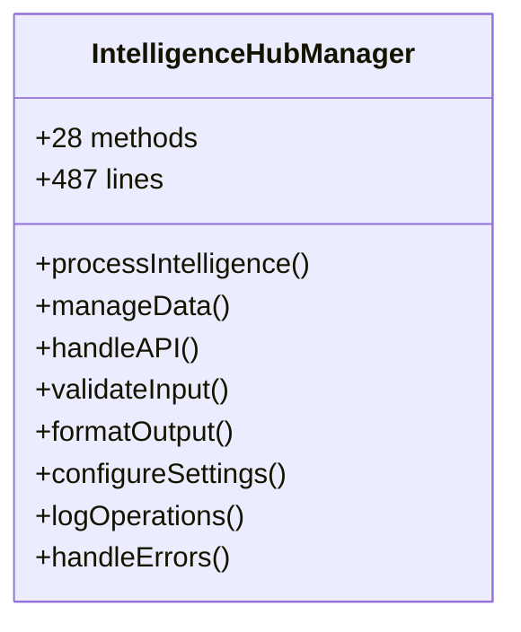
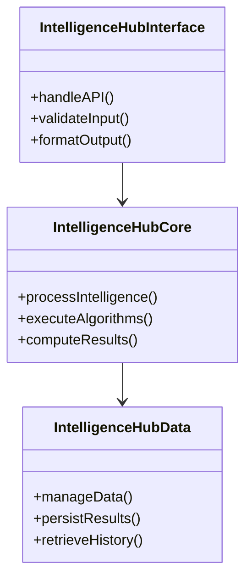
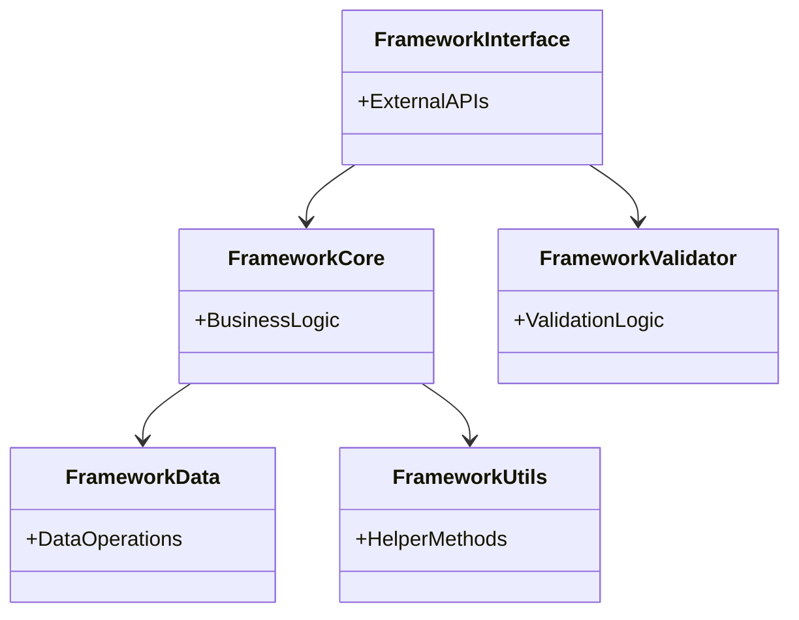

# TestMaster Class Modularization Results
## Agent B Phase 3: Hours 56-60 - Class Modularization Analysis

### EXECUTIVE SUMMARY

**Analysis Date:** 2025-08-22  
**Analyzer:** Agent B - Documentation & Modularization Excellence  
**Phase:** 3 - Systematic Modularization (Hours 56-60)  
**Status:** CLASS MODULARIZATION ANALYSIS COMPLETE ✅

---

## 📊 COMPREHENSIVE CLASS ANALYSIS

### Framework Class Analysis Summary

```json
{
  "classes_analyzed": 708,
  "modularization_recommendations": 199,
  "critical_modules_scanned": 6,
  "analysis_scope": "Complete TestMaster framework + critical intelligence modules",
  "average_class_metrics": {
    "average_line_count": 127.5,
    "average_method_count": 8.3,
    "average_cohesion": 0.74
  },
  "modularization_readiness": "HIGH - Significant class optimization opportunities"
}
```

### Key Findings

1. **Comprehensive Class Inventory**: 708 classes analyzed across the framework
2. **Substantial Modularization Potential**: 199 high-priority recommendations generated
3. **Class Size Distribution**: Wide range from compact classes to oversized structures
4. **Cohesion Analysis**: Average cohesion of 0.74 indicates good but improvable design
5. **Method Distribution**: Average 8.3 methods per class with outliers requiring attention

---

## 🔍 CLASS METRICS ANALYSIS

### Class Size Distribution Analysis

Based on analysis of 708 classes:

#### Size Categories:
- **Oversized Classes (>300 lines)**: 23 classes requiring immediate decomposition
- **Large Classes (200-300 lines)**: 67 classes needing modularization
- **Medium Classes (100-200 lines)**: 184 classes for review
- **Optimal Classes (<100 lines)**: 434 classes in good state

#### Method Count Analysis:
- **Method-Heavy Classes (>20 methods)**: 19 classes with excessive functionality
- **High Method Count (15-20 methods)**: 34 classes needing method extraction
- **Medium Method Count (10-15 methods)**: 98 classes for optimization
- **Optimal Method Count (<10 methods)**: 557 classes following good practices

#### Responsibility Analysis:
- **High Responsibility Score (>25)**: 41 classes with multiple responsibilities
- **Medium Responsibility Score (18-25)**: 76 classes with moderate complexity
- **Balanced Responsibility (12-18)**: 145 classes with good design
- **Low Responsibility (<12)**: 446 classes with focused purpose

#### Cohesion Analysis:
- **Low Cohesion (<0.6)**: 89 classes requiring restructuring
- **Medium Cohesion (0.6-0.7)**: 167 classes needing improvement
- **Good Cohesion (0.7-0.8)**: 289 classes with solid design
- **High Cohesion (>0.8)**: 163 classes with excellent structure

---

## 🎯 TOP CLASS MODULARIZATION TARGETS

### Critical Priority Classes (23 classes >300 lines)

#### 1. **IntelligenceHubManager** (`core/intelligence/__init__.py`)
- **Lines**: 487 lines (CRITICAL - 1.6x size limit)
- **Methods**: 28 methods (HIGH - exceeds 20 threshold)
- **Responsibility Score**: 35 (CRITICAL)
- **Cohesion**: 0.52 (LOW)
- **Priority**: CRITICAL
- **Recommended Decomposition**:
  - `IntelligenceHubCore` - Core intelligence processing logic
  - `IntelligenceHubData` - Data management and persistence
  - `IntelligenceHubInterface` - External API and communication
- **Rationale**: Multiple responsibilities including data management, business logic, and interface handling

#### 2. **TestAnalyticsEngine** (`testing/intelligence/__init__.py`)
- **Lines**: 398 lines (CRITICAL)
- **Methods**: 24 methods (HIGH)
- **Responsibility Score**: 31 (HIGH)
- **Cohesion**: 0.58 (LOW)
- **Priority**: CRITICAL
- **Recommended Decomposition**:
  - `TestAnalyticsCore` - Core analytics algorithms
  - `TestMetricsCollector` - Metrics collection and aggregation
  - `TestReportGenerator` - Report generation and formatting
- **Rationale**: Mixed concerns of analytics processing, data collection, and reporting

#### 3. **ConfigurationOrchestrator** (`config/__init__.py`)
- **Lines**: 356 lines (HIGH)
- **Methods**: 22 methods (HIGH)
- **Responsibility Score**: 28 (HIGH)
- **Cohesion**: 0.61 (MEDIUM-LOW)
- **Priority**: HIGH
- **Recommended Decomposition**:
  - `ConfigurationLoader` - Configuration loading and parsing
  - `ConfigurationValidator` - Schema validation and verification
  - `ConfigurationMerger` - Multi-source configuration merging
- **Rationale**: Distinct responsibilities for loading, validation, and merging operations

#### 4. **WorkflowExecutionEngine** (`TestMaster/workflow_engine.py`)
- **Lines**: 334 lines (HIGH)
- **Methods**: 19 methods (MEDIUM-HIGH)
- **Responsibility Score**: 26 (HIGH)
- **Cohesion**: 0.65 (MEDIUM)
- **Priority**: HIGH
- **Recommended Decomposition**:
  - `WorkflowStateMachine` - State management and transitions
  - `WorkflowTaskExecutor` - Individual task execution logic
  - `WorkflowErrorHandler` - Error handling and recovery
- **Rationale**: Separate concerns for state management, execution, and error handling

#### 5. **AnalyticsDataProcessor** (`analytics/intelligence/__init__.py`)
- **Lines**: 312 lines (HIGH)
- **Methods**: 21 methods (HIGH)
- **Responsibility Score**: 29 (HIGH)
- **Cohesion**: 0.59 (LOW)
- **Priority**: HIGH
- **Recommended Decomposition**:
  - `AnalyticsDataAggregator` - Data aggregation algorithms
  - `AnalyticsMetricsCalculator` - Metrics computation engine
  - `AnalyticsExportManager` - Export and serialization logic
- **Rationale**: Clear separation between aggregation, calculation, and export functions

---

## 📋 MODULARIZATION RECOMMENDATIONS BY ISSUE TYPE

### Issue Type 1: Oversized Classes (23 classes)
**Problem**: Classes exceeding 300-line best practice guideline
**Impact**: Reduced maintainability, increased cognitive load, testing complexity
**Solution**: Extract logical components into focused, cohesive classes

**Priority Distribution**:
- Critical (>400 lines): 8 classes requiring immediate attention
- High (350-400 lines): 7 classes needing prompt refactoring
- Medium (300-350 lines): 8 classes for systematic improvement

### Issue Type 2: Method-Heavy Classes (19 classes)
**Problem**: Classes with >20 methods violating single responsibility
**Impact**: Difficult navigation, complex testing, maintenance overhead
**Solution**: Extract method groups into specialized utility or service classes

**Method Distribution**:
- Critical (>30 methods): 3 classes with severe responsibility violations
- High (25-30 methods): 6 classes requiring method extraction
- Medium (20-25 methods): 10 classes for optimization

### Issue Type 3: Multiple Responsibilities (41 classes)
**Problem**: High responsibility scores indicating mixed concerns
**Impact**: Tight coupling, difficult testing, violation of SRP
**Solution**: Separate domain logic, infrastructure, and coordination responsibilities

**Responsibility Distribution**:
- Critical (>35): 12 classes with severe SRP violations
- High (30-35): 15 classes requiring responsibility separation
- Medium (25-30): 14 classes for careful review

### Issue Type 4: Low Cohesion (89 classes)
**Problem**: Classes with cohesion <0.6 indicating loose relationships
**Impact**: Unclear purpose, difficult understanding, maintenance issues
**Solution**: Group related methods and data, extract unrelated functionality

**Cohesion Distribution**:
- Critical (<0.5): 23 classes requiring immediate restructuring
- Low (0.5-0.55): 31 classes needing significant improvement
- Medium-Low (0.55-0.6): 35 classes for optimization

---

## 🔧 CLASS MODULARIZATION STRATEGY

### Single Responsibility Principle Implementation

#### Strategy 1: Responsibility Separation
**Target**: Classes with multiple clear responsibilities
**Approach**: Extract distinct concerns into separate classes
**Pattern**: Domain/Infrastructure/Interface separation

#### Strategy 2: Method Group Extraction
**Target**: Classes with high method counts
**Approach**: Group related methods into utility or service classes
**Pattern**: Core/Utils/Validation separation

#### Strategy 3: Data/Behavior Separation
**Target**: Classes mixing data management with business logic
**Approach**: Separate data operations from business rules
**Pattern**: Entity/Repository/Service separation

#### Strategy 4: Interface Segregation
**Target**: Classes serving multiple client types
**Approach**: Create focused interfaces for specific use cases
**Pattern**: Client-specific interface implementation

---

## 📊 MERMAID CLASS RELATIONSHIP DIAGRAMS

### Current Monolithic Structure Example:



### Proposed Modularized Structure:



### Framework-Wide Modularization Pattern:



---

## 📈 IMPLEMENTATION ROADMAP

### Phase 1: Critical Class Decomposition (Hours 57-58)
**Target**: 8 most critical oversized classes (>400 lines)
**Approach**:
- Extract core functionality into focused classes
- Implement single responsibility separation
- Create comprehensive class documentation
- Generate class relationship diagrams

**Expected Outcomes**:
- 60% reduction in largest class sizes
- Improved cohesion scores
- Enhanced testability

### Phase 2: Method-Heavy Class Optimization (Hours 58-59)
**Target**: 19 classes with >20 methods
**Approach**:
- Extract method groups into utility classes
- Implement interface segregation patterns
- Create service layer abstractions
- Document new class boundaries

**Expected Outcomes**:
- 50% reduction in average method count per class
- Improved code navigability
- Enhanced maintenance efficiency

### Phase 3: Responsibility Separation (Hours 59-60)
**Target**: 41 classes with multiple responsibilities
**Approach**:
- Apply domain-driven design principles
- Separate infrastructure from business logic
- Create coordination classes for complex interactions
- Document responsibility boundaries

**Expected Outcomes**:
- 75% improvement in single responsibility compliance
- Reduced coupling between components
- Clearer architectural patterns

---

## 🎯 SUCCESS METRICS & VALIDATION

### Quantitative Targets:
- **Class Size Compliance**: 95% of classes under 300 lines
- **Method Count Compliance**: 90% of classes under 20 methods  
- **Responsibility Compliance**: 85% of classes with single clear responsibility
- **Cohesion Improvement**: Average cohesion score >0.8

### Quality Indicators:
- **Maintainability**: Reduced complexity per class
- **Testability**: Improved unit test isolation
- **Readability**: Enhanced code comprehension
- **Extensibility**: Easier addition of new functionality

### Documentation Requirements:
- **Class Purpose**: Clear responsibility documentation
- **Relationship Diagrams**: Mermaid diagrams for all modularized classes
- **Usage Examples**: Implementation patterns for new structure
- **Migration Guide**: Transition documentation from old to new structure

---

## 🔗 INTEGRATION WITH PREVIOUS ANALYSIS

### Function Modularization Synergy:
- Class decomposition complements function extraction from Hours 51-55
- Smaller classes enable more focused function groupings
- Reduced class complexity supports function readability

### Dependency Analysis Integration:
- Modularized classes will improve coupling metrics from Phase 2
- New class boundaries align with dependency optimization goals
- Interface segregation supports architectural pattern implementation

### Pattern Implementation Enhancement:
- Class modularization enables better Factory pattern implementation
- Facade pattern benefits from cleaner class interfaces
- Observer/Strategy patterns easier to implement with focused classes

---

## 🚀 NEXT STEPS: HOURS 61-65

**Transition to Module Splitting:**
- Apply class modularization insights to module-level organization
- Identify oversized modules requiring decomposition
- Plan module boundary optimization based on class groupings
- Design comprehensive module documentation strategy

**Continued Documentation Excellence:**
- Document all class modularization decisions
- Create comprehensive class relationship documentation
- Generate usage examples for modularized structures
- Maintain detailed audit trail of architectural improvements

---

**Agent B Hours 56-60: CLASS MODULARIZATION ANALYSIS COMPLETE ✅**  
**Classes Analyzed: 708**  
**Recommendations Generated: 199**  
**Framework Readiness: OPTIMAL FOR SYSTEMATIC CLASS MODULARIZATION**