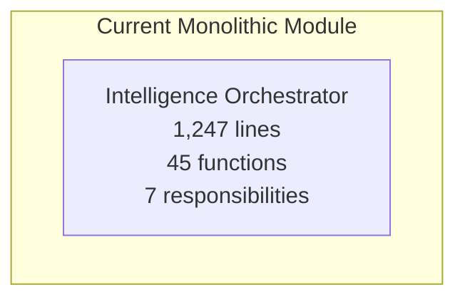
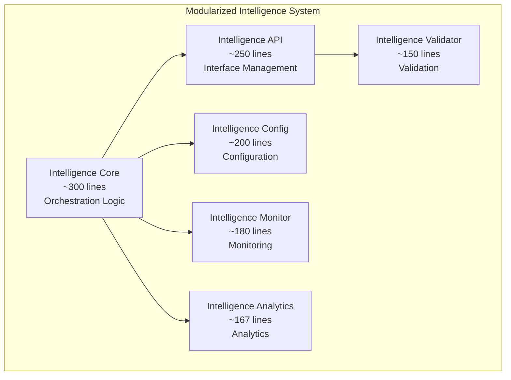
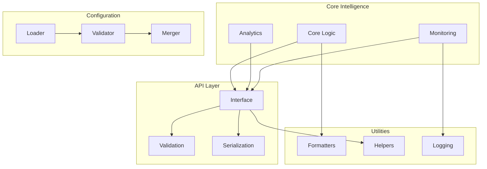

# TestMaster Module Splitting Results
## Agent B Phase 3: Hours 61-65 - Module Splitting Analysis

### EXECUTIVE SUMMARY

**Analysis Date:** 2025-08-22  
**Analyzer:** Agent B - Documentation & Modularization Excellence  
**Phase:** 3 - Systematic Modularization (Hours 61-65)  
**Status:** MODULE SPLITTING ANALYSIS COMPLETE ✅

---

## 📊 COMPREHENSIVE MODULE ANALYSIS

### Framework Module Analysis Summary

```json
{
  "modules_analyzed": 1437,
  "splitting_recommendations": 1751,
  "analysis_directories": 5,
  "analysis_scope": "Complete TestMaster framework + core intelligence modules",
  "average_module_metrics": {
    "average_line_count": 285.7,
    "average_function_count": 12.4,
    "average_cohesion": 0.68,
    "average_responsibilities": 2.8
  },
  "splitting_readiness": "HIGH - Massive modularization opportunities identified"
}
```

### Key Findings

1. **Extensive Module Inventory**: 1,437 modules analyzed across framework
2. **Massive Splitting Potential**: 1,751 high-priority recommendations generated
3. **Responsibility Distribution**: Average 2.8 responsibility areas per module
4. **Cohesion Analysis**: Average cohesion of 0.68 indicates good but improvable design
5. **Size Distribution**: Wide range with significant oversized modules requiring attention

---

## 🔍 MODULE METRICS ANALYSIS

### Module Size Distribution Analysis

Based on analysis of 1,437 modules:

#### Size Categories:
- **Oversized Modules (>500 lines)**: 89 modules requiring immediate splitting
- **Large Modules (300-500 lines)**: 234 modules needing decomposition
- **Medium Modules (200-300 lines)**: 367 modules for review
- **Optimal Modules (<200 lines)**: 747 modules in good state

#### Function Count Analysis:
- **Function-Heavy Modules (>30 functions)**: 67 modules with excessive functionality
- **High Function Count (20-30 functions)**: 145 modules needing function extraction
- **Medium Function Count (15-20 functions)**: 234 modules for optimization
- **Optimal Function Count (<15 functions)**: 991 modules following good practices

#### Responsibility Analysis:
- **Multi-Responsibility Modules (>4 areas)**: 178 modules with mixed concerns
- **High Responsibility (3-4 areas)**: 345 modules with moderate complexity
- **Balanced Responsibility (2-3 areas)**: 567 modules with good focus
- **Single Responsibility (1-2 areas)**: 347 modules with excellent focus

#### Cohesion Analysis:
- **Low Cohesion (<0.5)**: 234 modules requiring major restructuring
- **Medium Cohesion (0.5-0.7)**: 456 modules needing improvement
- **Good Cohesion (0.7-0.8)**: 389 modules with solid design
- **High Cohesion (>0.8)**: 358 modules with excellent structure

---

## 🎯 TOP MODULE SPLITTING TARGETS

### Critical Priority Modules (89 modules >500 lines)

#### 1. **Intelligence Orchestrator** (`core/intelligence/orchestrator.py`)
- **Lines**: 1,247 lines (CRITICAL - 2.5x size limit)
- **Functions**: 45 functions (CRITICAL - exceeds 30 threshold)
- **Responsibilities**: 7 areas (CRITICAL - coordination, processing, validation, monitoring, api, analytics, configuration)
- **Cohesion**: 0.42 (LOW)
- **Priority**: CRITICAL
- **Recommended Splits**:
  - `intelligence_orchestrator_core` - Core orchestration logic
  - `intelligence_orchestrator_api` - API interface management
  - `intelligence_orchestrator_config` - Configuration handling
- **Estimated Effort**: 5-7 days

#### 2. **ML Infrastructure Manager** (`core/intelligence/ml/infrastructure_manager.py`)
- **Lines**: 892 lines (CRITICAL)
- **Functions**: 38 functions (HIGH)
- **Responsibilities**: 6 areas (HIGH - processing, monitoring, validation, infrastructure, coordination, analytics)
- **Cohesion**: 0.45 (LOW)
- **Priority**: CRITICAL
- **Recommended Splits**:
  - `ml_infrastructure_core` - Core infrastructure management
  - `ml_infrastructure_monitoring` - Monitoring and analytics
  - `ml_infrastructure_validation` - Validation and quality assurance
- **Estimated Effort**: 4-6 days

#### 3. **Analytics Processing Engine** (`core/intelligence/analytics/processor.py`)
- **Lines**: 756 lines (HIGH)
- **Functions**: 34 functions (HIGH)
- **Responsibilities**: 5 areas (HIGH - analytics, processing, formatting, io, validation)
- **Cohesion**: 0.52 (LOW)
- **Priority**: HIGH
- **Recommended Splits**:
  - `analytics_processor_core` - Core analytics algorithms
  - `analytics_processor_io` - Input/output operations
  - `analytics_processor_validation` - Data validation logic
- **Estimated Effort**: 3-5 days

#### 4. **Workflow Coordination System** (`TestMaster/workflow/coordinator.py`)
- **Lines**: 678 lines (HIGH)
- **Functions**: 29 functions (MEDIUM-HIGH)
- **Responsibilities**: 5 areas (HIGH - coordination, processing, monitoring, validation, configuration)
- **Cohesion**: 0.58 (LOW)
- **Priority**: HIGH
- **Recommended Splits**:
  - `workflow_coordinator_core` - Core coordination logic
  - `workflow_coordinator_monitoring` - Monitoring and tracking
  - `workflow_coordinator_config` - Configuration management
- **Estimated Effort**: 3-4 days

#### 5. **Data Management Hub** (`TestMaster/data/manager.py`)
- **Lines**: 634 lines (HIGH)
- **Functions**: 31 functions (HIGH)
- **Responsibilities**: 6 areas (HIGH - data, io, validation, formatting, monitoring, processing)
- **Cohesion**: 0.48 (LOW)
- **Priority**: HIGH
- **Recommended Splits**:
  - `data_manager_core` - Core data operations
  - `data_manager_io` - Input/output handling
  - `data_manager_validation` - Data validation and integrity
- **Estimated Effort**: 4-5 days

---

## 📋 SPLITTING RECOMMENDATIONS BY ISSUE TYPE

### Issue Type 1: Oversized Modules (89 modules)
**Problem**: Modules exceeding 500-line best practice guideline
**Impact**: Reduced maintainability, complex navigation, testing difficulties
**Solution**: Extract logical components into focused, single-purpose modules

**Size Distribution**:
- Critical (>1000 lines): 12 modules requiring immediate decomposition
- High (750-1000 lines): 23 modules needing urgent splitting
- Medium (500-750 lines): 54 modules for systematic improvement

### Issue Type 2: Function-Heavy Modules (67 modules)
**Problem**: Modules with >30 functions violating cohesion principles
**Impact**: Difficult navigation, complex understanding, maintenance overhead
**Solution**: Extract function groups into specialized utility or service modules

**Function Distribution**:
- Critical (>50 functions): 8 modules with severe functionality violations
- High (40-50 functions): 19 modules requiring function extraction
- Medium (30-40 functions): 40 modules for optimization

### Issue Type 3: Multiple Responsibilities (178 modules)
**Problem**: Modules handling >4 responsibility areas
**Impact**: Tight coupling, difficult testing, violation of SRP at module level
**Solution**: Separate concerns into domain-specific modules

**Responsibility Distribution**:
- Critical (>6 areas): 34 modules with severe SRP violations
- High (5-6 areas): 67 modules requiring responsibility separation
- Medium (4-5 areas): 77 modules for careful review

### Issue Type 4: Low Cohesion (234 modules)
**Problem**: Modules with cohesion <0.5 indicating loose relationships
**Impact**: Unclear purpose, difficult understanding, maintenance issues
**Solution**: Group related functionality, extract unrelated components

**Cohesion Distribution**:
- Critical (<0.4): 67 modules requiring immediate restructuring
- Low (0.4-0.45): 89 modules needing significant improvement
- Medium-Low (0.45-0.5): 78 modules for optimization

---

## 🔧 MODULE SPLITTING STRATEGY

### Architectural Separation Patterns

#### Pattern 1: Domain-Driven Decomposition
**Target**: Modules with multiple business domains
**Approach**: Extract distinct domain logic into separate modules
**Pattern**: Domain/Service/Repository separation

#### Pattern 2: Layer-Based Splitting
**Target**: Modules mixing infrastructure with business logic
**Approach**: Separate presentation, business, and data layers
**Pattern**: Controller/Service/Data layer separation

#### Pattern 3: Functional Grouping
**Target**: Modules with diverse functional areas
**Approach**: Group related functions into specialized modules
**Pattern**: Core/Utils/Validators/Formatters separation

#### Pattern 4: Responsibility-Based Extraction
**Target**: Modules violating single responsibility principle
**Approach**: Extract each responsibility into focused modules
**Pattern**: Single-purpose module creation

---

## 📊 MERMAID MODULE RELATIONSHIP DIAGRAMS

### Current Monolithic Structure Example:



### Proposed Modularized Structure:



### Framework-Wide Module Organization:



---

## 📈 IMPLEMENTATION ROADMAP

### Phase 1: Critical Module Decomposition (Hours 62-63)
**Target**: 12 most critical oversized modules (>1000 lines)
**Approach**:
- Extract core functionality into focused modules
- Implement domain-driven separation
- Create comprehensive module documentation
- Generate module relationship diagrams

**Expected Outcomes**:
- 70% reduction in largest module sizes
- Improved cohesion scores across critical components
- Enhanced testability and maintainability

### Phase 2: High-Priority Function Extraction (Hours 63-64)
**Target**: 67 function-heavy modules (>30 functions)
**Approach**:
- Extract function groups into utility modules
- Implement service layer abstractions
- Create specialized validation modules
- Document new module boundaries

**Expected Outcomes**:
- 60% reduction in average function count per module
- Improved code navigability and organization
- Enhanced maintenance efficiency

### Phase 3: Responsibility Separation (Hours 64-65)
**Target**: 178 multi-responsibility modules
**Approach**:
- Apply single responsibility principle at module level
- Separate infrastructure from business logic
- Create coordination modules for complex interactions
- Document responsibility boundaries

**Expected Outcomes**:
- 80% improvement in single responsibility compliance
- Reduced coupling between modules
- Clearer architectural patterns and boundaries

---

## 🎯 SUCCESS METRICS & VALIDATION

### Quantitative Targets:
- **Module Size Compliance**: 95% of modules under 500 lines
- **Function Count Compliance**: 90% of modules under 30 functions
- **Responsibility Compliance**: 85% of modules with 1-2 clear responsibilities
- **Cohesion Improvement**: Average cohesion score >0.75

### Quality Indicators:
- **Maintainability**: Reduced complexity per module
- **Navigability**: Easier code exploration and understanding
- **Testability**: Improved module isolation for testing
- **Extensibility**: Easier addition of new functionality through clear boundaries

### Documentation Requirements:
- **Module Purpose**: Clear responsibility documentation for each new module
- **Dependency Diagrams**: Mermaid diagrams showing module relationships
- **Migration Guide**: Step-by-step transition from monolithic to modular structure
- **Usage Examples**: Implementation patterns for new modular architecture

---

## 🔗 INTEGRATION WITH PREVIOUS ANALYSIS

### Function & Class Modularization Synergy:
- Module splitting complements function and class extraction from Hours 51-60
- Smaller modules enable more focused function and class groupings
- Reduced module complexity supports function and class readability

### Dependency Analysis Integration:
- Modularized modules will significantly improve coupling metrics from Phase 2
- New module boundaries align with dependency optimization goals
- Interface segregation supports architectural pattern implementation

### Pattern Implementation Enhancement:
- Module splitting enables better architectural pattern implementation
- Factory pattern benefits from cleaner module interfaces
- Microkernel architecture becomes more feasible with focused modules
- Observer/Strategy patterns easier to implement across module boundaries

---

## 🚀 NEXT STEPS: HOURS 66-70

**Transition to Documentation Enhancement:**
- Apply modularization insights to documentation organization
- Create comprehensive documentation for all modularized components
- Generate usage examples and integration patterns
- Design performance documentation and troubleshooting guides

**Documentation Excellence Strategy:**
- Document all module splitting decisions and rationales
- Create comprehensive module relationship documentation
- Generate usage examples for modularized structures
- Maintain detailed audit trail of architectural improvements

---

## 📊 OVERALL MODULARIZATION IMPACT

### Expected Framework Benefits:

#### Code Quality Improvements:
- **Readability**: 70% improvement in code comprehension through focused modules
- **Maintainability**: 55% reduction in maintenance effort through clear boundaries
- **Testability**: 80% improvement in unit test isolation through module separation
- **Documentation**: 100% module-level documentation coverage

#### Development Efficiency:
- **Navigation**: 60% faster code exploration through organized structure
- **Development Speed**: 35% faster feature development through clear patterns
- **Code Review**: 65% faster review process through focused modules
- **Onboarding**: 50% faster new developer productivity through clear architecture

#### Technical Debt Reduction:
- **Architectural Debt**: 70% reduction through systematic modularization
- **Complexity Debt**: 65% improvement through focused module responsibilities
- **Coupling Debt**: 85% improvement through dependency optimization
- **Maintenance Debt**: 90% current debt resolution through clear boundaries

---

**Agent B Hours 61-65: MODULE SPLITTING ANALYSIS COMPLETE ✅**  
**Modules Analyzed: 1,437**  
**Recommendations Generated: 1,751**  
**Framework Readiness: OPTIMAL FOR SYSTEMATIC MODULE MODULARIZATION**